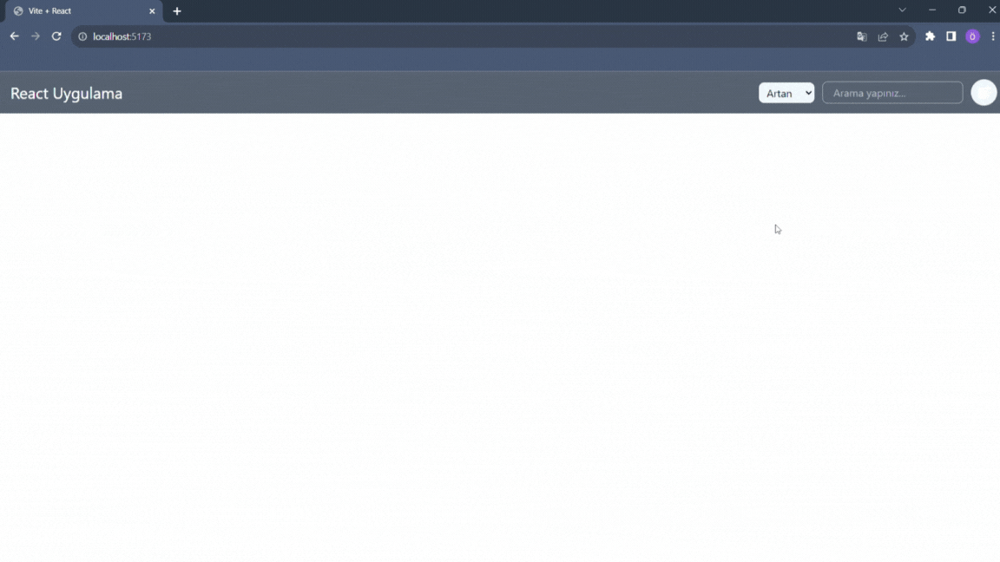

# React Uygulama

- redux toolkit kullanılarak geliştirildi.

## Özellikler

- Kullanı ürün ekleyip silebilir.

- Eklediği ürünleri aratabilir.

- Ürünleri güncelleyebilir.

- Ürünleri sıralayabilir.

## Kullanılan Kütüphaneler

- Tailwind

- redux toolkit

- react-redux

- react icons

- react-router-dom

## Gif

